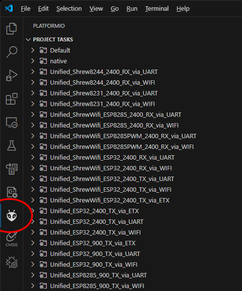
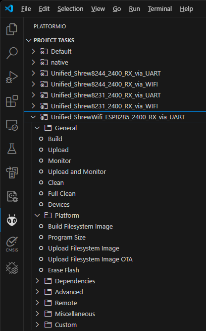
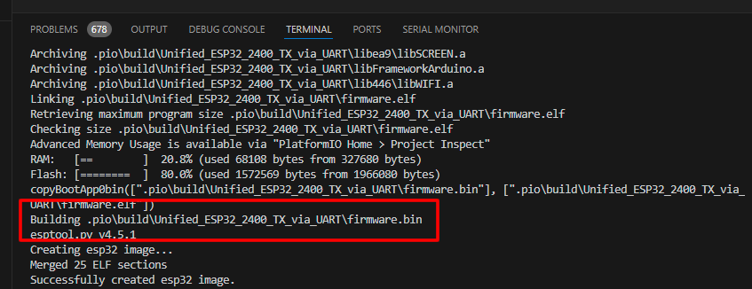
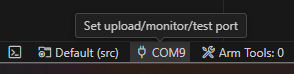
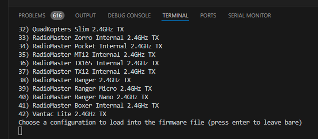

# Source Code Build Instructions

The source code isn't actually in this repository. To respect the open source nature of ExpressLRS, the source code resides on my fork of the original ExpressLRS repo, under a branch named `shrew`. https://github.com/frank26080115/ExpressLRS/tree/shrew

## Install VSCode and PlatformIO

The build environment is required.

 * https://code.visualstudio.com/
 * https://platformio.org/install/ide?install=vscode

## Checkout the Source Code

Assuming you are familiar with git and GitHub

 * The repo is at https://github.com/frank26080115/ExpressLRS, clone or fork this
 * Checkout the branch named `shrew`
 * Use VSCode, open the folder `.../ExpressLRS/src` with VSCode

## Building and Installing

If you've done the above correctly, then when you click the PlatformIO button, a list of possible build options will show up.

Only the build configurations with the word `Shrew` in it will feature the new Wi-Fi control capabilities.

The `_2400_` in each configuration name indicates it's meant to use 2.4 GHz radios. The `_RX_` or `_TX_` in the name determines if it's meant for a receiver or transmitter, respectively.

When you expand one of the build configurations, actions appear

The action `Build` will compile a final firmware `*.bin` file. The console will indicate where this file is saved. If you are using the build configuration that ends with `_WIFI`, then you can upload this `*.bin` file through ELRS's web interface uploader to perform a firmware update. (see https://www.expresslrs.org/quick-start/webui/#the-update-tab and specifically the section on the `update` tab)

NOTE: this points to a path that looks more like `...\ExpressLRS\src\.pio\build\Unified_ESP32_2400_TX_via_UART\firmware.bin`

The action `Upload` is useful if you are already connected to the hardware with a UART adapter. The build configuration must end with `_UART`, the COM port is selected at the bottom of your screen.

To use UART upload mode, the ELRS circuit must be [placed into bootloader mode](https://www.expresslrs.org/quick-start/unbricking/) before you click this button! Most ELRS transmitter modules go into bootloader mode automatically. If you do not know how to place a ELRS receiver into bootloader mode, its user manual should tell you how.

If you experience problems, it might be fixed by erasing the flash (which is only possible through the UART method), and also performing a clean.

## Build Customization

There's a file located at `.../ExpressLRS/src/user_defines.txt` that you can customize. Most importantly, you can set the bind-phrase, and you can set the `AUTO_WIFI_ON_INTERVAL`.

For ELRS external transmitter modules, set `AUTO_WIFI_ON_INTERVAL` to a number under 10 to activate the new Wi-Fi control capabilities. If this number is not set to something below 10, then it Wi-Fi controls will not actually work.

For ELRS receivers, if `AUTO_WIFI_ON_INTERVAL` is set too low, it might not have enough time to link with a ELRS transmitter before transitioning to Wi-Fi mode. Therefore, only set `AUTO_WIFI_ON_INTERVAL` very low if you do not plan on using a ELRS transmitter with the ELRS receiver.

Currently, the build is only targeting the small nano ELRS receivers, and the RadioMaster Ranger Nano transmitter, as these are the only ones I have to test with. If you want to target your own hardware:

 * Close VSCode
 * Delete the folder `.../ExpressLRS/src/hardware`
 * Open VSCode again and build for your configuration

When you do this, more options will show up at the end of the build, in the build console. You need to select the hardware through the build console.

