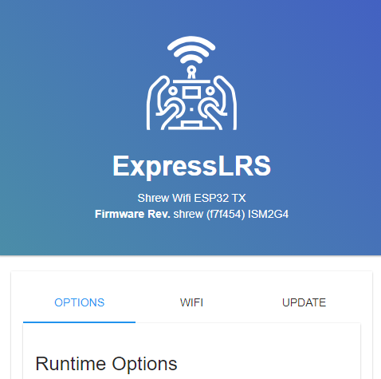
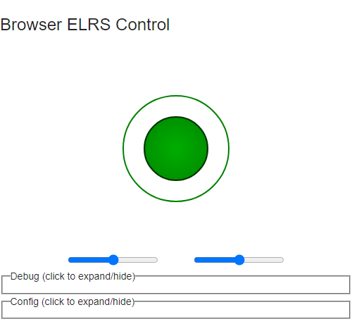
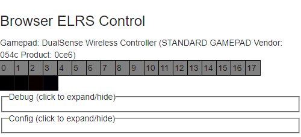
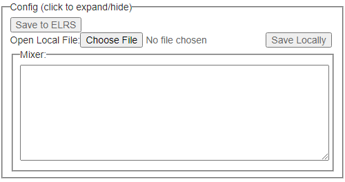

# Operation Instructions

## Activating Wi-Fi Mode

For ELRS receivers, simply do the usual method to activate Wi-Fi mode, which is to just wait until the LED starts blinking very rapidly. You can set the time you need to wait with the `AUTO_WIFI_ON_INTERVAL` option.

For ELRS external transmitter modules, the installation instructions I've provided have already told you to set `AUTO_WIFI_ON_INTERVAL` to a number lower than 10. If you did so and powered on the module without an attached handset (with a USB cable, or with a battery), it should automatically go into the Wi-Fi mode.

Once Wi-Fi is active, you can scan for it with the SSID `ExpressLRS RX` or `ExpressLRS TX`. Connect to it once it's been found. The default password is `expresslrs`.

Once connected, use a web browser to visit `http://10.0.0.1/`, and you will see a web page where you can adjust ELRS options.



More information: https://www.expresslrs.org/quick-start/webui/ (this page also includes how to use the bind-phrase)

## Binding

Using the above web page, setting a binding phrase on the transmitter, and also the same binding phrase on the receiver, will effectively bind that transmitter to the receiver.

## Other options for transmitter modules

Some transmitter modules have a screen where other options can be adjusted. I do not own one of these, so I cannot provide more details. Please consult the user manual. I think the interface might resemble the Lua interface (mentioned below).

Otherwise, please use the Lua script when you attach the module to the back of an actual RC system. More instructions: https://www.expresslrs.org/quick-start/transmitters/tx-prep/ and https://www.expresslrs.org/quick-start/transmitters/lua-howto/

## Activating Wi-Fi Control Mode

Use a web browser to visit `http://10.0.0.1/shrew.html`



The green circle is a virtual joystick that you can drag around with your finger.

If you connect a gamepad (such as a PlayStation DualSense), the screen will change to look like



Each one of those squares represents a button, pressing a button on the DualSense will make a square turn red.

## Mixing, Assigning Channel Values

There is a textbox called the Mixer



You need to write JavaScript code into that textbox in order to assign channel values.

Channel values are raw CRSF values, so numbers between 172 and 1811 are generally acceptable, with 992 being the center value (representing a servo pulse 1500 microseconds long).

The object `channel` is an array of 16 elements, it is zero-indexed, channel one is represented by `channel[0]`. To set the channel value, for example, you can write `channel[0] = 1234;`.

The object `variable` is an array of 32 elements that you can use for whatever purpose you want.

The on-screen touchable joysticks are represented by `Joy1` and `Joy2` (which appears on the screen only if you mention it in the code). Both of these objects have functions `.GetX()` and `.GetY()` that return a number between -1.0 and +1.0, with 0 being center. There's a convenient function available to map values -1.0 to +1.0 to CRSF values, so for example, `channel[0] = scaleToCRSF(Joy1.GetX(), 1);`. These functions will be explained more later.

The on-screen sliders are represented by `Slider1` and `Slider2`. Both of these objects have a `.value` property between 0 and 100. There's a convenient function available to map values 0 to 100 to CRSF values, so for example, `channel[0] = sliderToCRSF(Slider1.value, 1);`.

If a gamepad is connected, it is represented by the object `MyGamepad`. For official documentation on this object, visit [https://developer.mozilla.org/en-US/docs/Web/API/Gamepad](https://developer.mozilla.org/en-US/docs/Web/API/Gamepad). The most important properties are the `.axes` and `.buttons` properties (these are arrays). For example, you can write something like `channel[0] = scaleToCRSF(MyGamepad.axes[0], 1);`.

If you want to handle gamepad button presses as events, you can write `OnButtonPress = function(idx) { /* code that handles .buttons[idx] press */ };`

The code you write is not effective until it ends with `return true;`

There are three buttons that allow you to save and load your mixer. Using `Save to ELRS` will let it be automatically reloaded the next time. Using local files will allow you to manage multiple copies.

### Mixer Convenience Functions

`function clamp(value, limit1, limit2)`, it returns the input if it's between the two limits, otherwise, it returns the limit.

`function mapRange(value, low1, high1, low2, high2, limit)`, this is similar to the Arduino's `map` function https://www.arduino.cc/reference/en/language/functions/math/map/ but there is a boolean option `limit` to keep the return value between the output range.

`function applyDeadzone(x, dz)`, apply a deadzone `dz` to `x`. For example, if the `dz` is 0.1 and `x` is 0.05, then the return value will be 0. If `x` is 0.7 then the return value will be about 0.7.

`function applyExpo(x, ex)`, apply an exponential curve to the input `x` (expected range of `x` is -1.0 to +1.0). The `ex` parameter is how curvy you want it. `ex` being 0 means "linear". Positive `ex` values result in a steeper slop as `x` grows larger. Negative `ex` values result in a steeper slop as `x` gets smaller. Positive `ex` values are used to make controls more sensitive and easier to control. Negative `ex` values can be used to compensate for electric motors with low torque at low speeds.

`function scaleToCRSF(x, s)` will convert a number ranged -1.0 to +1.0 into the range CRSF needs. The `s` parameter is a multiplier, use `s` set to 1 for a normal conversion.

`function sliderToCRSF(x, s)` will convert a number ranged 0 to +100 into the range CRSF needs. The `s` parameter is a multiplier, use `s` set to 1 for a normal conversion.

`function arcadeTankMix(t, s)` will mix a 2-axis joystick input and output the two motor speeds needed for tank-style motion. This is meant for robotics. The parameter `t` is throttle, `s` is steering, both ranged -1.0 to +1.0. The output is an array with two elements, representing the left and right motor speeds, both ranged -1.0 to +1.0. For example:
```
var motor_speeds = arcadeTankMix(Joy1.GetY(), Joy1.GetX());
channel[0] = scaleToCRSF(motor_speeds[0], 1);
channel[1] = scaleToCRSF(motor_speeds[1], 1);
return true;
```
... is the complete code for the world's most basic robot.

For more information about tank drive, see https://en.wikipedia.org/wiki/Differential_steering and https://en.wikipedia.org/wiki/Tank_steering_systems and https://xiaoxiae.github.io/Robotics-Simplified-Website/drivetrain-control/arcade-drive/

`function simpleTankMix(...)` is a very powerful function to do the same as above, but you don't even need to provide any inputs. There is instead a ton of optional parameters.

The optional parameters, meaning, and their default values:

| name | meaning | default value |
|------|---------|---------------|
| mode | where the data comes from and how it is mixed | 0 |
| thr_scale | throttle scaling, adjust to change throttle sensitivity, negative to reverse | 1 |
| str_scale | steering scaling, adjust to change steering sensitivity, negative to reverse | 1 |
| thr_dz | throttle input deadzone | 0 |
| str_dz | steering input deadzone | 0 |
| thr_exp | throttle exponential curve, adjust to change throttle sensitivity via curve | 0 |
| str_exp | steering exponential curve, adjust to change steering sensitivity via curve | 0 |
| thr_trim | throttle input trim/offset | 0 |
| str_trim | steering input trim/offset | 0 |
|  left_scale | left  motor output scale | 1 |
| right_scale | right motor output scale | 1 |
|  left_dz | left  motor output deadzone | 0 |
| right_dz | right motor output deadzone | 0 |
|  left_exp | left  motor output exponential curve | 0 |
| right_exp | right motor output exponential curve | 0 |
|  left_trim | left  motor output trim/offset | 0 |
| right_trim | right motor output trim/offset | 0 |
| chan_offset | starting CRSF channel to write output to. 0 means `channel[0]` and `channel[1]` | 0 |

| mode | meaning|
|------|--------|
| function | instead of a number, you can provide a function that outputs a 2-element array, `output[0]` should be throttle, `output[1]` should be steering, both between -1.0 and +1.0 |
| 0 | Use data from `Joy1` |
| 1 | `Joy1` for throttle, `Joy2` for steering |
| 2 | `Joy2` for throttle, `Joy1` for steering |
| 3 | Use gamepad, use left stick |
| 4 | Use gamepad, use right stick |
| 5 | Use gamepad, left stick for throttle, right stick for steering |
| 6 | Use gamepad, right stick for throttle, left stick for steering |
| 7 | Use gamepad, right trigger accelerates, left trigger brake/reverse, any stick for steering |
| 8 | Use gamepad, left trigger accelerates, right trigger brake/reverse, any stick for steering |

To call this function with optional parameters, the code looks like `simpleTankMix({mode:0});` or `simpleTankMix({mode: 0 , thr_scale: 0.9 , str_scale: 0.5});`
