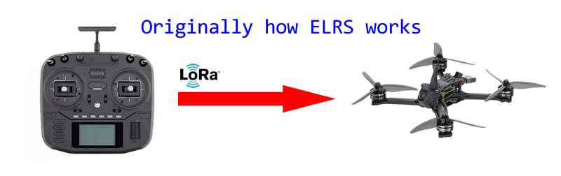
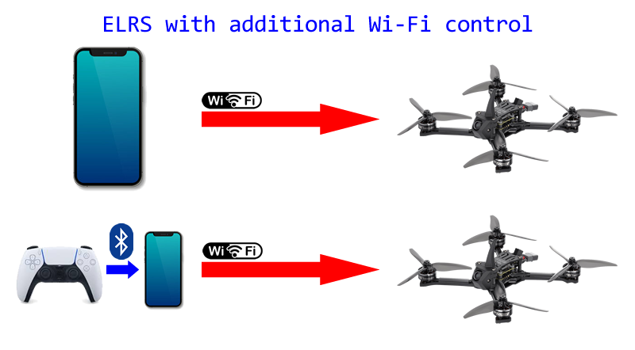
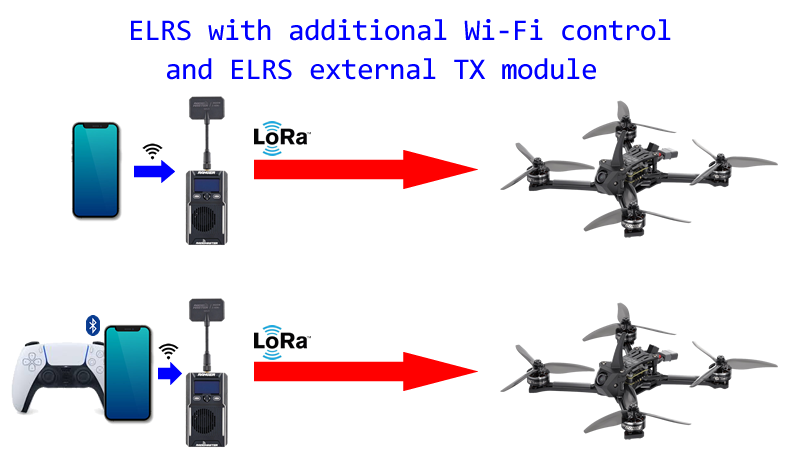

# ELRS-Control-Over-WiFi-and-Gamepad

ExpressLRS control over Wi-Fi (and even with a gamepad)

[ExpressLRS, or ELRS](https://www.expresslrs.org/), is an open source remote control system, comprising of a transmitter and receiver. It is exceptionally high performance, with low latency, high data rates, and long range.

The most common ELRS hardware use Espressif microcontrollers such as the ESP32 and ESP8. These microcontrollers feature Wi-Fi capabilities and so a lot of ELRS user configuration is conveniently done through a Wi-Fi interface.

Typically, a ELRS transmitter is connected to a remote control transmitter running EdgeTX.

My project, here in this repo you are seeing, aims to allow users to not use a remote control device, instead, the user can simply use the Wi-Fi connection to issue commands. The Wi-Fi interface will serve up a web page with a virtual touch controlled joystick. It can even support a connected Bluetooth gamepad.

This works with directly with a ELRS RX, or with an external ELRS TX module.

This is all done with additional firmware features added on top of existing ELRS firmware. After a firmware update, original ELRS functionality will still work. The firmware can also be reverted at any time.

## Important Notes

ELRS uses LoRa for its long range capability. The Wi-Fi antennas on ELRS hardware are often very compromised. Using the additional Wi-Fi control mode to a receiver without LoRa means that there is significantly less range. It may not be suitable for RC aircraft.

Since a smartphone browser is used, the data update rate is significantly reduced. ELRS is capable of 1000 packets per second but a smartphone browser can probably only achieve about 30 control updates in one second.

Using a Bluetooth gamepad will add significant latency.

As somebody who uses ELRS in robotics competitions, I whole-heartedly do not recommend this be used in any competitions or aircraft. But I do recognize that this could be useful for some people.

## Instructions

 * [Building and Installation](Build-Install-Instructions.md)
 * [Operation Instructions](Operation-Instructions.md)

## Other

 * [Developer Commentary](developer-commentary.md)
